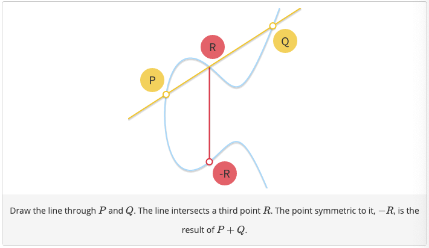

# Information Security Stuff  
some graded and ungraded homeworks from different information security courses offered at ETH Zürich 

## Elliptic Curve Cryptography.
The following two exercises on Elliptic Curve Cryptography formed the first graded homework of the course Information Security Lab offered at ETH Zurich in the autumn semester of 2020. In the first part, we focus on implementing ECDSA. In particular, we implement several functions such as the addition of points on elliptic curves and a scalar multiply function. Note that addition on elliptic curves is defined as follows (as indicated in the drawing).

In the second part of the assignment, we focus on implementing cryptanalysis of ECDSA based on nonce leakages. We had to implement attack algorithms that recover the secret ECDSA signing key based on either complete or partial information about the nonce(s) used in the ECDSA signing algorithm. In the exercise, we had to consider three flavors of cryptanalytic attacks, namely known-nonce attacks, repeated-nonce attacks and partially-known-nonce attacks. 

## Implementation of streamlined layer of Transport Layer Protocol 
This exercise is the second graded homework of the course Information Security Lab offered at ETH Zurich in the autumn semester of 2020. In this lab we investigate and implement a (streamlined) version of one of the most important cryptographic protocols in use today - the Transport Layer Security Protocol, version 1.3 (throughout the lab we will refer to this simply as TLS 1.3). We use the symmetric and asymmetric cryptoprimitives and use them to implement aspects of TLS 1.3. Specifically, we implemented functions for the Session Resumption mechanisms used in the TLS 1.3 Protocol.

Important to note here is that the uploaded files are the code that I wrote. However, with the assignment a skeleton code was provided also containing other code necessary to run the function. Therefore this code cannot be run, and its main purpose is to show an example of an (streamlined) implementation of TLS. 

## SCION Network
This exercise is the fourth graded homework of the course Information Security Lab offered at ETH Zurich in the autumn semester of 2020. We work on the future internet architecture SCION, developed at ETH. In this lab we work on Denial of Service attacks. The first part of the lab concerns the implementation of a Denial of Service attack, where we try to amplify the message that we send and spoof our address (to the address of the victim) and in addition we also spoof the path to this victim (this is only needed if the victim is in a different AS as us). The second part of the lab is the implementation of a defence against Denial of Service attack. The main idea is here that we detect whether all the "malicious" packets are coming from one AS, after which we block that entire AS, or if all the malicious packets are coming from one IP, after which we block this IP. 

## Memory Corruption and Runtime Attacks (Software Security)
This exercise is the sixth graded homework of the course Information Security Lab offered at ETH Zurich in the autumn semester of 2020. We focus on memory corruption vulnerabilities. These vulnerabilities allow specially-crafted attacker inputs to tamper with a vulnerable software by changing and overwriting the software’s memory in its stack or heap. 
- We use the interactive dissasembler software Gidhra to disassemple and decompile the executables. (A decoompiler tries to reconstruct a reasonable interpretation of the original source code in pseudo-code or any mainstream language like C).
- To run the executable and to see the layout of the memory (e.g. the stack) and the value of the gloabl variables, we use the debugger tool GDB. 

This assignment was split up into smaller sections, of which I explain the goal below:
- 1b: We need to make a call to a so called "uncallable function" defined somewhere in the code. The strategy we adopt is 

## Basic Encoding, OTP, TTP and RC4
This exercise is based on the first ungraded homework of the course Applied Cryptography offered at ETH Zurich in the spring semester of 2020.
We just perform basic encoding in hexadecimal bytes and decoding. Furthermore, we look at weaknesses of one time pads. In particular, we break on time pad encryption in the specific cases that either the plaintext is encrypted bitwise with the same bit throughout (by trying out all possible bits) and when the same on time pad is used twice for encryption
